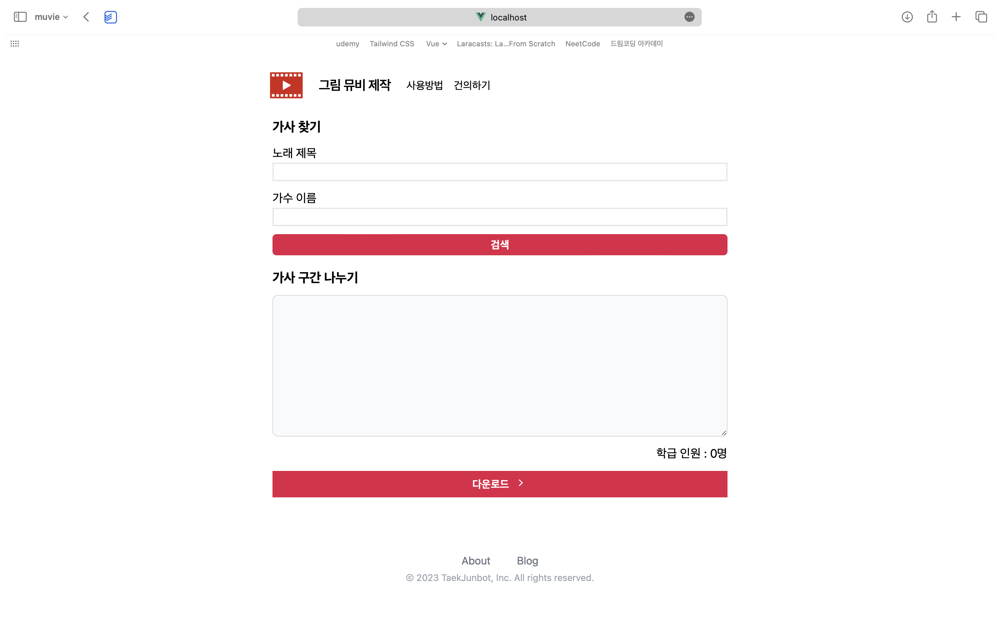
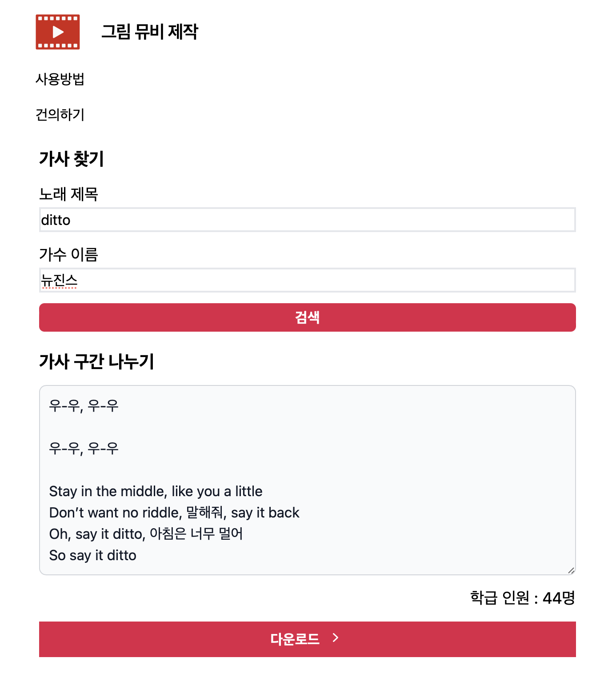
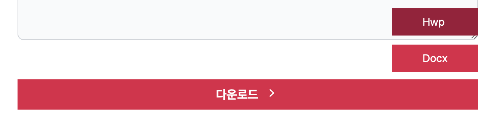
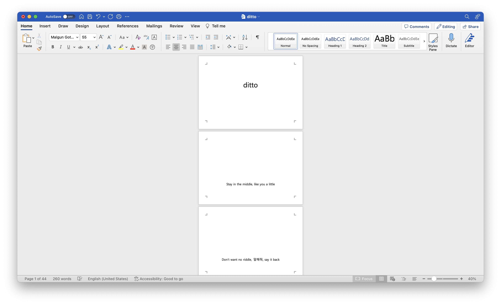

<a name="readme-top"></a>

[![Contributors][contributors-shield]][contributors-url]

<!-- PROJECT LOGO -->
<!-- <br />
<div align="center">
  <a href="https://github.com/teacher-coder/picture-muvie">
    
  </a> -->

<h3 align="center">PicMuvie(Music Video)</h3>

  <p align="center">
    초등학교에서 그림 뮤비 제작을 돕는 사이트입니다
    <br />
    <a href="https://github.com/teacher-coder/picture-muvie"><strong>Explore the docs »</strong></a>
    <br />
    <br />
    <a href="https://github.com/teacher-coder/picture-muvie">View Demo</a>
    ·
    <a href="https://github.com/teacher-coder/picture-muvie/issues">Report Bug</a>
    ·
    <a href="https://github.com/teacher-coder/picture-muvie/issues">Request Feature</a>
  </p>
</div>

<!-- TABLE OF CONTENTS -->
<details>
  <summary>Table of Contents</summary>
  <ol>
    <li><a href="#quick-start">Quick Start</a></li>
    <li><a href="#about-the-project">About The Project</a></li>
      <ul>
        <li><a href="#built-with">Built With</a></li>
      </ul>
    <li>  
      <a href="#getting-started">Getting Started</a>
      <ul>
        <li><a href="#prerequisites">Prerequisites</a></li>
        <li><a href="#installation">Installation</a></li>
      </ul>
    </li>
    <li><a href="#usage">Usage</a></li>
    <li><a href="#roadmap">Roadmap</a></li>
    <li><a href="#reference">Reference</a></li>
  </ol>
</details>

<!-- QUICK START -->

## Quick Start

### 1. Clone the repo

```sh
git clone https://github.com/techer-coder/picture-muvie.git
```

### 2. Run project

```sh
docker-compose -f docker-compose.dev.yml up --build
```

<!-- ABOUT THE PROJECT -->

## About The Project

유튜브를 보면 학생들의 그림 뮤비 영상이 많이 올라와 있습니다. 그런데 막상 우리 반을 위해 뮤비를 만드려고 하면 노래 가사 문서 만드는 것부터 큰 관문입니다. 다음과 같은 문제를 차례로 겪게 됩니다.

1. 가사를 소절별로 문서 각 페이지마다 붙여넣기를 해서 만들어야 합니다. 학생 수가 25명이니 25페이지네?
2. 운이 좋게 다른 선생님들이 작업하신 파일을 구했습니다. 가사가 15 페이지만 있네요? 우리반은 25명인데...

문서 작업에 시간이 오래 걸리거나 학급 인원수에 맞지 않는 문제를 해결하기 위해서 프로젝트를 시작하게 되었습니다. 선생님들이 손쉽게 자신의 학급 수에 맞게 가사 파일을 만들 수 있도록 했습니다. 본 서비스는 다음과 같은 단계로 진행됩니다.

1. 노래 제목과 가수를 입력하여 가사를 검색합니다
2. 가사 줄의 개수는 학급 인원 수를 나타냅니다. 학급 인원 수에 맞게 줄을 수정합니다
3. 문서 파일을 다운로드 받습니다



<p align="right">(<a href="#readme-top">back to top</a>)</p>

### Built With

- [![Vue][vue.js]][vue-url]
- [![Django][django.com]][django-url]
- [![PostgreSQL][postgresql.com]][postgresql-url]
- [![Nginx][nginx.com]][nginx-url]

<p align="right">(<a href="#readme-top">back to top</a>)</p>

<!-- GETTING STARTED -->

## Getting Started

### Prerequisites

- python

  ```sh
  brew install python
  ```

- poetry

  ```sh
  brew install poetry
  ```

- npm

  ```sh
  brew install npm@latest -g
  ```

- docker

  ```sh
  brew install docker
  ```

### Docker

#### 1-1. In Development Mode

1. Build docker images & Run containers <u>**(!check execute cmd in 'root' directory)**</u>

   ```sh
   docker-compose -f docker-compose.dev.yml up --build
   ```

2. Run containers by using existing one

   ```sh
   docker-compose -f docker-compose.dev.yml up
   ```

3. Run docker in demon mode

   ```sh
   docker-compose -f docker-compose.dev.yml up -d
   ```

4. Check docker images are set

   ```sh
   docker images
   ```

5. Check docker containers are running well

   ```sh
   docker ps -a
   ```

6. Inspect docker containers <u>**(!check docker containers still running)**</u>

   ```sh
   docker exec -it <container_names> <shell.dir>
   # docker exec -it frontend sh
   # docker exec -it db bin/bash/
   ```

<p align="right">(<a href="#readme-top">back to top</a>)</p>

<!-- USAGE EXAMPLES -->

## Usage

### 1. 가사 검색



### 2. 한글 또는 word로 다운로드



### 3. 가사 소절별로 각 페이지 나뉜 문서 확인



<p align="right">(<a href="#readme-top">back to top</a>)</p>

## Roadmap

- [ ] 학급 인원 수 30명을 기본으로 가사 제공
- [ ] 가사 이미지 업로드 후 영상 편집 기능

See the [open issues](https://github.com/teacher-coder/picture-muvie/issues) for a full list of proposed features (and known issues).

<p align="right">(<a href="#readme-top">back to top</a>)</p>

## Reference

### poetry 패키지 관리 방법

- [공식 사이트](https://python-poetry.org/docs/basic-usage/)
- [참고 블로그](https://velog.io/@whattsup_kim/Python-%ED%8C%8C%EC%9D%B4%EC%8D%AC-%ED%99%98%EA%B2%BD-%EA%B5%AC%EC%B6%95%ED%95%98%EA%B8%B0-2-Poetry#poetry%EB%9E%80)

### commit message conventions

- [AngularJS Git Commit Message Conventions](https://gist.github.com/stephenparish/9941e89d80e2bc58a153)

<p align="right">(<a href="#readme-top">back to top</a>)</p>

<!-- MARKDOWN LINKS & IMAGES -->
<!-- https://www.markdownguide.org/basic-syntax/#reference-style-links -->

[contributors-shield]: https://img.shields.io/github/contributors/teacher-coder/picture-muvie.svg?style=for-the-badge
[contributors-url]: https://github.com/teacher-coder/picture-muvie/graphs/contributors
[linkedin-shield]: https://img.shields.io/badge/-LinkedIn-black.svg?style=for-the-badge&logo=linkedin&colorB=555
[linkedin-url]: https://linkedin.com/in/linkedin_username
[product-screenshot]: images/screenshot.png
[vue.js]: https://img.shields.io/badge/Vue.js-35495E?style=for-the-badge&logo=vuedotjs&logoColor=4FC08D
[vue-url]: https://vuejs.org/
[django.com]: https://img.shields.io/badge/Django-092E20?style=for-the-badge&logo=django&logoColor=white
[django-url]: https://djangoproject.com
[nginx.com]: https://img.shields.io/badge/Nginx-009639?style=for-the-badge&logo=nginx&logoColor=white
[nginx-url]: https://www.nginx.com
[postgresql.com]: https://img.shields.io/badge/PostgreSQL-4169E1?style=for-the-badge&logo=postgresql&logoColor=white
[postgresql-url]: https://www.postgresql.org
